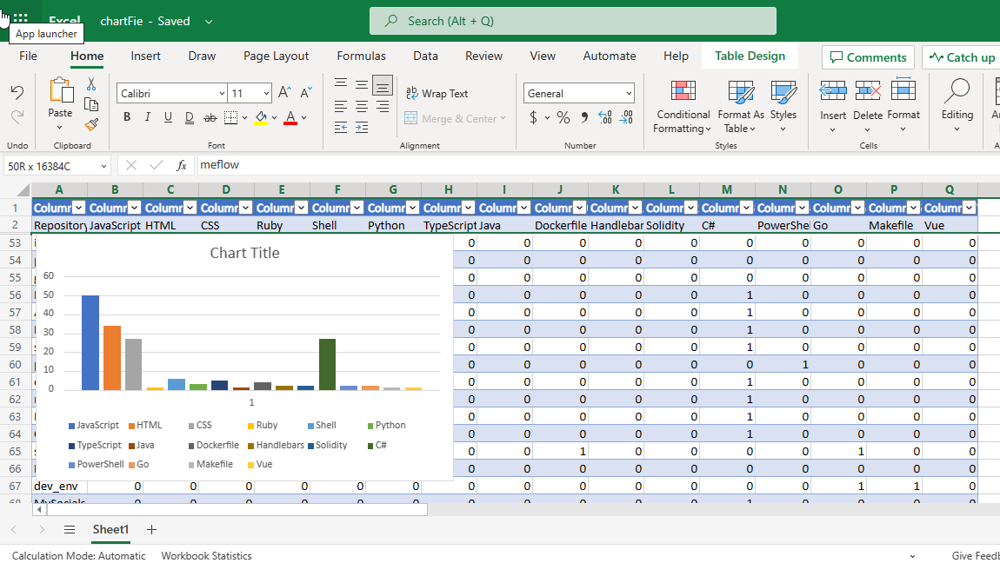

# Project Description:

This project aims to analyze the languages used in all of your GitHub repositories and create a chart of the language distribution using Microsoft Graph. The project uses GitHub's API to retrieve the metadata of all your repositories, including the languages used in each repository. Then, it aggregates the language data to calculate the total number of repositories that use each language.

The project is implemented in .NET and uses the Octokit .NET library to interact with the GitHub API. The Octokit .NET library is a fully-featured GitHub API client library that allows developers to easily access and manipulate GitHub data.

The project makes use of Microsoft Graph to create a chart of the language distribution in Excel. Microsoft Graph is a powerful tool that allows developers to integrate Microsoft products and services into their applications, including Excel. By using Microsoft Graph, the project can easily create a chart in Excel that shows the language distribution of all your repositories.

Overall, this project provides an easy way to analyze the language distribution of all your GitHub repositories and visualize the results in Excel. It can be useful for developers who want to understand the overall composition of their codebase and identify areas where they may need to focus their efforts.

Here are some reference links that you can use to learn more about the technologies and libraries used in your project:

- Octokit .NET Library: https://octokitnet.readthedocs.io/en/latest/
- GitHub REST API: https://docs.github.com/en/rest
- Microsoft Graph: https://docs.microsoft.com/en-us/graph/overview
- Microsoft Graph API for Excel: https://docs.microsoft.com/en-us/graph/api/resources/excel?view=graph-rest-1.0

## Sample Image

